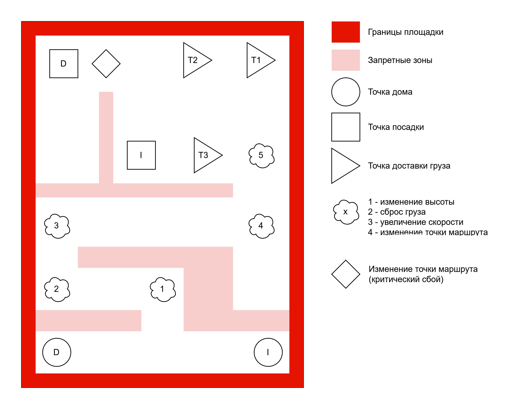

# Региональные Инженерные Соревнования 2026 в Москве: Кибериммунная автономность роевого взаимодействия роботов с применением ИИ для распознавания информации

Оглавление:

- Цель и смысл мероприятия
- Расписание мастер-классов
- Трасса с киберпрепятствиями
- Киберпрепятствия
- Ограничения на используемое ПО и оборудование дронов
- Ответственность за сохранность дронов
- Уровни участия и оценка результатов
- Кодекс Этики
- Протесты

## Цель и смысл мероприятия

Региональные Инженерные Соревнования  – площадка для апробации возможных решений по обеспечению устойчивости дронов к кибератакам при их роевом взаимодействии.

Целью проведения Региональных Инженерных Соревнований является проверка решений по обеспечению повышения безопасности автономных полетов дронов, апробации роевого взаимодействия кибериммунных дронов и тестирование возможности применения готовых БАС (беспилотных авиационных систем) для кибериммунного подхода.

Региональные Инженерные Соревнования предполагают оцениваемую, соревновательную часть, состоящую из двух этапов: заочного и очного. Во время заочного этапа участники знакомятся с проектом и выполняют квалификационное задание в цифровом двойнике (симуляторе). В ходе очного этапа участники разрабатывают программы для модуля безопасности двух дронов – инспектора и доставщика – обеспечивающие безопасное и автономное исследование области и определение точки доставки груза, а затем непосредственно доставки.  Десять команд, показавших лучшие результаты на заочном этапе, допускаются до очного этапа, где та же задача выполняется с использованием реальных дронов.

## Расписание мастер-классов

Региональные Инженерные Соревнования представляют собой не только соревнования, но и образовательный интенсив. Каждый день будут проводиться тематические мастер-классы связанные с заданиями этого дня. За сданные успешно задания дня команда получает баллы. Если задания одного дня сдаются в другой день, то баллы команда не получает, однако выполнить задания нужно, чтобы продвинуться дальше т.к. задания связанны между собой. Роли в команде рекомендуемые и команды сами решают какие роли между участниками команды и как распределять. Один и тот же участник может брать на себя несколько ролей.

| День | Роль | Тема | Задача |
| ---  | ---  | ---  | ---    |
| Первый | Инженеры | Настройка, калибровка и запуск квадрокоптера | Дрон без КП, без сервера, без МБ (прошивка, разрешающая все) должен взлететь в указанной нами точке, пролететь по указанным точкам и сесть в указанной точке. |
| Первый | Программисты | Введение в Цифровой двойник | Повторить квалификационное задание, но в онлайне с полным циклом взаимодействия со своим ИОрВД. |
| Второй | Инженеры (при небольшой поддержке программистов) | Запуск квадрокоптера с ИОрВД | Задание первого дня, но в онлайне с организаторским ИОрВД. Снятие логов с показаниями долготы, широты и высоты. |
| Второй | Программист 1 | Взаимодействие дронов | В ЦД исследователь должен долететь до любой точки, передать точку доставщику и вернуться на базу. Доставщик должен доставить груз в переданную точку. Без КП, без зон, со своим ИОрВД. |
| Второй | Программист 2 | Киберпрепятствия. Часть I | В ЦД сделать обход трех КП: сброс груза, скорость и высота. Показать их обход в ЦД, без зон, в любых точках, можно в офлайн или онлайн. |
| Третий | Инженер 1 (при поддержке программиста 1) | Взаимодействие дронов | На двух физических дронах повторить задание Программиста 1 второго дня. |
| Третий | Инженер 2 (при поддержке программиста 2) | Киберпрепятствия. Часть I | На физическом дроне продемонстрировать обход КП (поочередно, задавая КП через параметры Mission Planner'а); можно онлайн или офлайн. |
| Третий | Программист 1 | Обнаружение меток | В ЦД продемонстрировать скан меток и обход плохих советов от ИИ. |
| Третий | Программист 2 | Киберпрепятствия. Часть II | В ЦД продемонстрировать обход некритического и критического изменения местоположения, с зонами безопасности, можно в онлайн или в офлайн, можно без остальных КП, проверяемые КП - в указанных местах. |
| Четвёртый | Инженер 1 и Программист 1 | Обнаружение меток | На физическом дроне продемонстрировать скан меток, их отправку на сервер ИИ и обход плохих советов. |
| Четвёртый | Инженер 2 и Программист 2 | Киберпрепятствия. Часть II | На физическом дроне продемонстрировать обход некритического и критического изменения местоположения, можно в онлайн или офлайн, поочередно. |
| Пятый | Вся команда | Полный пролёт | На большой площадке совершить полный пролет по всему сценарию. |

## Трасса

К моменту начала очного этапа соревнований расположение и количество элементов может быть изменено для создания элемента неожиданности.

Основной задачей группы дронов является доставка груза до одной из трех точек разгрузки.
Определение правильной точки возможно с использованием дрона-исследователя, который должен сфотографировать расположенные в точках разгрузки метки, передать их идентификаторы на сервер ИОрВД и получить ответ о том, является ли проканированная точка целевой. После выполнения задачи дрон-исследователь должен вернуться в определенную ему посадочную точку.
Дрон-доставщик должен получить сообщение о том, в какую из точек ему необходимо произвести доставку, проложить путь до этой точки и выполнить доставку груза. После доставки, дрон-доставщик также должен вернуться в определенную ему посадочную точку.
В процессе полета дроны не должны нарушать цели безопасности, описанные в документе [Кибериммунный автономный квадрокоптер-доставщик](docs/ARCHITECTURE.md).

Командам будут предоставлены координаты всех возможных точек разгрузки, точки дома и точки посадки для обоих дронов. Также будет предоставлены примеры миссии для каждого из дронов: команды в своих полетах могут использовать её, модифицировать любым способом или использовать полностью свою миссию. Координаты запретной зоны известны командам заранее.

Для предотвращения возможных столкновений квадрокоптеров, предполагается, что одномоментно крутятся пропеллеры только у одного квадрокоптера в полётной зоне.

## Киберпрепятствия и события

Что может произойти (пример):

- изменение скорости полета;
- изменение высоты полета;
- преждевременный сброс груза;
- изменение текущей точки полетного задания;
- ошибочные рекомендации от ИИ.

Работая в цифровом двойнике не забывайте, что на реальной трассе вы будете иметь дело с реальным физическим объектом, на который могут оказывать влияние множество факторов среды. Также важно не забывать об утверждённых целях и политиках безопасности.

## Ограничения на используемое ПО и оборудование дронов

Разрешается:

- модифицировать любым образом модуль безопасности в составе ПО дрона;
- модифицировать параметры полетного контроллера, доступные для редактирования в ПО управляющей станции.

Запрещается:

- менять любые компоненты полётного контроллера, предоставленные организаторами;
- использовать прошивки программного обеспечения дрона, приводящие к использованию во время прохождения дистанции любой версии ПО полетного контроллера, отличающейся от предоставленной организаторами всем участникам;
- использовать в коде проверки, которые определяют наступление того или иного киберпрепятствия за счет знания исходного кода полетного контроллера или иных, кроме модуля безопасности, частей системы;
- отключать код, приводящий к возникновению киберпрепятствий;
- использовать любые средства воздействия на дрон во время прохождения дистанции, кроме заранее установленной на дрон прошивки;
- использовать любые методы ручного управления дроном, кроме аварийных, вызванных требованиями безопасности;

В случае нарушения любого из этих пунктов команда может быть дисквалифицирована или оштрафована.

Требуется:

- разработать код прошивки МБ, который будет использоваться во время зачетных попыток;
- продемонстрировать целостность прошивки полетного контроллера, предоставленной организаторами всем участникам;
- перед выходом на трассу продемонстрировать успешное выполнение следующей последовательности действий: загрузка полетного задания, его согласование с ИОрВД, старт миссии, прерывание полета по команде ИОрВД (отключение моторов);
- представить жюри полные исходные коды ПО модуля безопасности дрона;
- предоставить полные логи-трейсы прохождения трассы.

## Ответственность за сохранность дронов

Перед осуществлением тестовой или зачетной попытки команда должна удостовериться в исправности оборудования, произвести, при необходимости, калибровку и настройку параметров, и при обнаружении проблем запросить замену дрона. После начала выполнения попытки претензии команды по состоянию оборудования не принимаются.

Все время соревнований дроны должны находится на территории проведения соревнований.

## Оценка результатов

Рейтинг команд-участников будет составляться на основе критериев представленных в документе [Критерии оценки команд на соревнованиях](docs/ASSESSMENT.md).

Победители определяются по максимальному количеству баллов, а при равном количестве баллов - по минимально суммарному времени прохождения трассы.

Окончательная формула расчета баллов объявляется организаторами командам перед началом тестовых попыток.

## Кодекс Этики

Миссия соревнований - вдохновить разработчиков на обучение дисциплинам, связанным с дронами, создание своих собственных проектов с применением методологии проектирования систем с конструктивной информационной безопасностью, а также развитие навыков и обмен опытом посредством участия в соревнованиях. Вот почему следующие аспекты являются ключевыми для всех наших соревнований и должны строго соблюдаться всеми лицами, задействованными в мероприятии:

1. Все лица, задействованные в мероприятии, обязаны быть вежливыми и открытыми друг с другом.
2. Организаторы, судьи, участники, тренеры и другие задействованные лица обязаны обеспечить честное и справедливое соревнование для всех участников.
3. Участники должны воздерживаться от любый действий, способных повлиять на результаты других участников.
4. Участники должны уважать окончательное решение судей и соблюдать субординацию.
5. Болельщики могут помогать, направлять и вдохновлять участников во время подготовки к соревнованиям, но создавать и программировать дрон вместо участников во время соревнований строго запрещено.

Во время проведения зачетных попыток не допускается использование любых средств, которые могут дать нечестное преимущество перед другими участниками.

## Протесты

Протест в отношении результатов соревнований (решений судей и полевых арбитров) подается капитаном команды в письменном виде по установленной форме, в течение 30 минут с момента вынесения судейского решения.

Диалог от лица команды ведет капитан команды; жалобы, исходящие от других членов команды, рассмотрению не подлежат.
